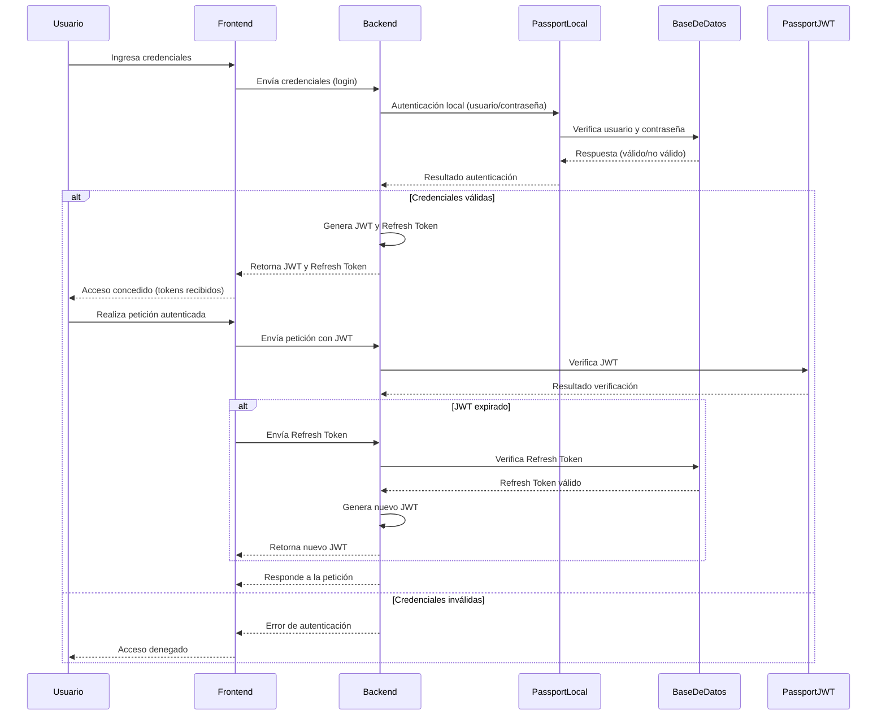

# sequenceAuth

```mermaid
sequenceDiagram
    participant Usuario
    participant Frontend
    participant Backend
    participant PassportLocal
    participant BaseDeDatos
    participant PassportJWT

    Usuario->>Frontend: Ingresa credenciales
    Frontend->>Backend: Envía credenciales (login)
    Backend->>PassportLocal: Autenticación local (usuario/contraseña)
    PassportLocal->>BaseDeDatos: Verifica usuario y contraseña
    BaseDeDatos-->>PassportLocal: Respuesta (válido/no válido)
    PassportLocal-->>Backend: Resultado autenticación
    alt Credenciales válidas
        Backend->>Backend: Genera JWT y Refresh Token
        Backend-->>Frontend: Retorna JWT y Refresh Token
        Frontend-->>Usuario: Acceso concedido (tokens recibidos)
        Usuario->>Frontend: Realiza petición autenticada
        Frontend->>Backend: Envía petición con JWT
        Backend->>PassportJWT: Verifica JWT
        PassportJWT-->>Backend: Resultado verificación
        alt JWT expirado
            Frontend->>Backend: Envía Refresh Token
            Backend->>BaseDeDatos: Verifica Refresh Token
            BaseDeDatos-->>Backend: Refresh Token válido
            Backend->>Backend: Genera nuevo JWT
            Backend-->>Frontend: Retorna nuevo JWT
        end
        Backend-->>Frontend: Responde a la petición
    else Credenciales inválidas
        Backend-->>Frontend: Error de autenticación
        Frontend-->>Usuario: Acceso denegado
    end

```
